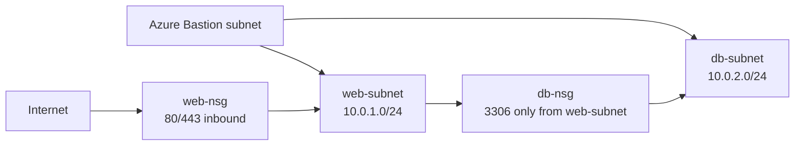

# Blueprint 01: Secure Network Entry Point

## Architecture Diagram



## What It Builds

- Resource group
- Virtual network with three subnets
- Web and database network security groups
- Bastion-ready subnet named `AzureBastionSubnet`
- Outputs for subnet IDs and cleanup review

## Cost Warning And Cleanup

This blueprint does not deploy Azure Bastion by default because Bastion can create steady hourly cost. It creates the required subnet so Bastion can be added intentionally.

Cleanup:

```bash
az group delete --name rg-blueprint-network-dev --yes --no-wait
```

## Bicep Deployment Steps

```bash
az login
az group create \
  --name rg-blueprint-network-dev \
  --location eastus

az deployment group create \
  --resource-group rg-blueprint-network-dev \
  --template-file bicep/main.bicep \
  --parameters @bicep/parameters.example.json
```

## Terraform Deployment Steps

```bash
az login
cd terraform
terraform init
terraform fmt
terraform plan
terraform apply
terraform destroy
```

## Validation Steps

```bash
az network vnet subnet list \
  --resource-group rg-blueprint-network-dev \
  --vnet-name vnet-blueprint-network-dev \
  --query "[].{name:name,addressPrefix:addressPrefix}" \
  --output table

az network nsg rule list \
  --resource-group rg-blueprint-network-dev \
  --nsg-name nsg-blueprint-db-dev \
  --output table
```

## Screenshots Or CLI Output

Store proof in `evidence/` after deployment:

- VNet subnet list
- NSG rule list
- Portal screenshot of network topology

## What I Learned

- Subnet boundaries are the foundation for later compute, database, and private endpoint designs.
- NSGs should express intent: internet to web, web to data, admin through a controlled path.
- Azure reserves `AzureBastionSubnet` as a special subnet name and requires a dedicated address range.

## Security Notes

- The database subnet does not allow internet inbound traffic.
- Bastion access should replace direct SSH/RDP exposure.
- In a production variant, add Azure Firewall, private endpoints, route tables, and diagnostic settings.

## Tradeoff Notes

- Bicep is concise for Azure-native networking and uses Azure resource types directly.
- Terraform makes state and review workflows explicit, which helps when multiple engineers manage the same network.
