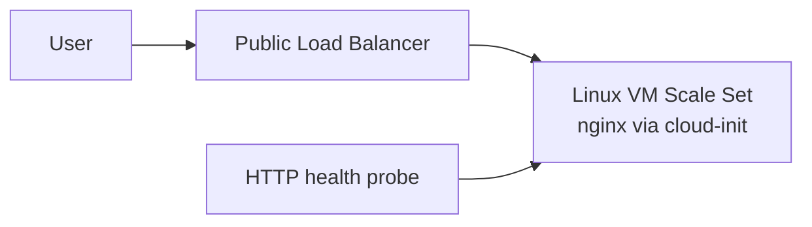

# Blueprint 02: Autoscaling Web Compute

## Architecture Diagram



## What It Builds

- Resource group
- Virtual network and web subnet
- Public IP and Azure Load Balancer
- Linux VM Scale Set with nginx bootstrap
- Autoscale-ready compute pattern

## Cost Warning And Cleanup

VM instances and public IPs cost money while running. Keep the VM SKU small and delete the resource group after testing.

Cleanup:

```bash
az group delete --name rg-blueprint-webcompute-dev --yes --no-wait
```

## Bicep Deployment Steps

```bash
az login
az group create \
  --name rg-blueprint-webcompute-dev \
  --location eastus

az deployment group create \
  --resource-group rg-blueprint-webcompute-dev \
  --template-file bicep/main.bicep \
  --parameters @bicep/parameters.example.json
```

## Terraform Deployment Steps

```bash
az login
cd terraform
terraform init
terraform fmt
terraform plan
terraform apply
terraform destroy
```

## Validation Steps

```bash
az vmss list-instances \
  --resource-group rg-blueprint-webcompute-dev \
  --name vmss-blueprint-webcompute-dev \
  --output table

az network public-ip show \
  --resource-group rg-blueprint-webcompute-dev \
  --name pip-blueprint-webcompute-dev \
  --query ipAddress \
  --output tsv
```

Open `http://<public-ip>` and confirm the nginx landing page responds.

## Screenshots Or CLI Output

Store proof in `evidence/`:

- VMSS instance list
- Load balancer public IP
- Browser screenshot showing nginx

## What I Learned

- VM Scale Sets separate image/bootstrap decisions from load-balancing and scale decisions.
- Health probes are what make a load balancer trustworthy.
- The smallest useful architecture still needs networking, compute, public access, and validation.

## Security Notes

- This lab exposes HTTP for learning; production should use HTTPS and a managed certificate.
- Avoid opening SSH to the internet. Use Bastion or a private admin path.
- Store admin keys securely and rotate them.

## Tradeoff Notes

- Bicep keeps Azure load balancer relationships explicit but can become verbose.
- Terraform makes repeated associations easier to modularize once the pattern grows.
