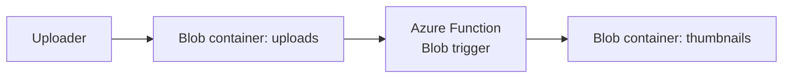

# Blueprint 03: Event-Driven Image Pipeline

## Architecture Diagram



## What It Builds

- Resource group
- Storage account
- `uploads` and `thumbnails` containers
- Consumption-plan Function App shell
- Application Insights for runtime visibility

## Cost Warning And Cleanup

Consumption-plan Functions are low-cost for light use, but storage transactions and logs can still accrue charges.

Cleanup:

```bash
az group delete --name rg-blueprint-imagepipe-dev --yes --no-wait
```

## Bicep Deployment Steps

```bash
az login
az group create \
  --name rg-blueprint-imagepipe-dev \
  --location eastus

az deployment group create \
  --resource-group rg-blueprint-imagepipe-dev \
  --template-file bicep/main.bicep \
  --parameters @bicep/parameters.example.json
```

Deploy function code separately with Azure Functions Core Tools or GitHub Actions.

## Terraform Deployment Steps

```bash
az login
cd terraform
terraform init
terraform fmt
terraform plan
terraform apply
terraform destroy
```

## Validation Steps

```bash
az storage container list \
  --account-name <storage-account-name> \
  --auth-mode login \
  --output table

az functionapp show \
  --resource-group rg-blueprint-imagepipe-dev \
  --name <function-app-name> \
  --query "{name:name,state:state,kind:kind}" \
  --output table
```

## Screenshots Or CLI Output

Store proof in `evidence/`:

- Container list
- Function App overview
- Function invocation logs after uploading an image

## What I Learned

- Event-driven design is a better fit than keeping image processing inside a web server.
- Storage naming is globally unique, so IaC should include a suffix strategy.
- Observability is part of the architecture, not an afterthought.

## Security Notes

- Public blob access is disabled.
- The Function App uses managed identity and Storage data-plane RBAC instead of committing or storing a storage account key in source.
- Put secrets in app settings sourced from Key Vault references where possible.
- If a hosting plan or runtime pattern requires `AzureWebJobsStorage` as a connection string, treat the storage key as sensitive because it can land in deployment history, app settings, and Terraform state.

## Tradeoff Notes

- Bicep is straightforward for the Azure-native resource graph.
- Terraform is useful when the function depends on external systems, DNS, GitHub, or other non-Azure providers.
