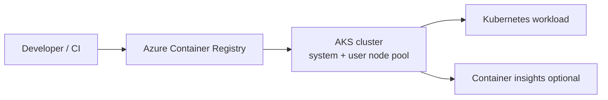

# Blueprint 04: Private Container Platform

## Architecture Diagram



## What It Builds

- Resource group
- Azure Container Registry
- AKS cluster with managed identity
- User node pool
- AcrPull permission from AKS kubelet identity to ACR

## Cost Warning And Cleanup

AKS node pools create VM costs even when no workload is running. Delete this lab when finished.

Cleanup:

```bash
az group delete --name rg-blueprint-aks-dev --yes --no-wait
```

## Bicep Deployment Steps

```bash
az login
az deployment sub create \
  --location eastus \
  --template-file bicep/main.bicep \
  --parameters @bicep/parameters.example.json
```

## Terraform Deployment Steps

```bash
az login
cd terraform
terraform init
terraform fmt
terraform plan
terraform apply
terraform destroy
```

## Validation Steps

```bash
az aks get-credentials \
  --resource-group rg-blueprint-aks-dev \
  --name aks-blueprint-aks-dev \
  --overwrite-existing

kubectl get nodes

az acr repository list \
  --name <acr-name> \
  --output table
```

## Screenshots Or CLI Output

Store proof in `evidence/`:

- `kubectl get nodes`
- ACR overview or repository list
- AKS node pool view

## What I Learned

- ACR integration is an identity and RBAC problem, not just a registry URL problem.
- Separating system and user node pools creates a cleaner production path.
- AKS makes Kubernetes easier to operate, but the cloud resources around it still need deliberate design.

## Security Notes

- Use managed identity instead of registry passwords.
- Private clusters, network policy, image scanning, and workload identity are natural next steps.
- Do not store kubeconfig or admin credentials in the repo.

## Tradeoff Notes

- Bicep exposes AKS resource details quickly as Azure adds features.
- Terraform is strong when AKS is only one part of a larger platform with DNS, GitHub, Helm, and monitoring providers.

